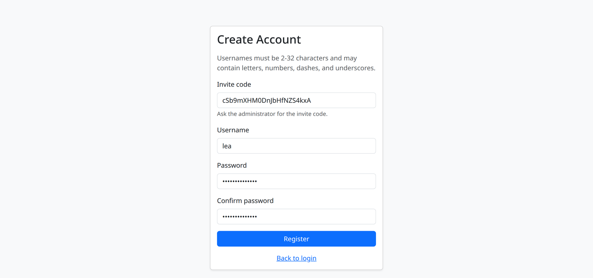
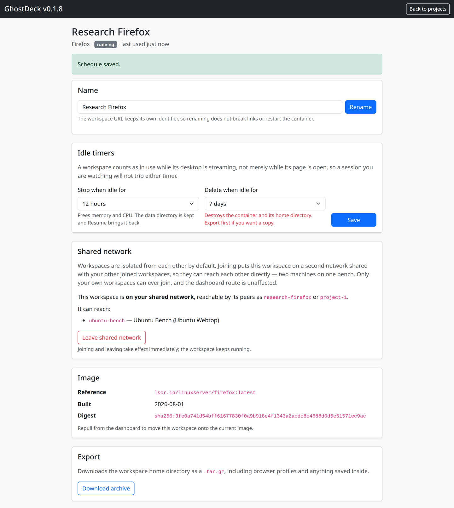

# GhostDeck

Self-hosted dashboard for disposable browser, messenger, Kali and Ubuntu workspaces. Create a workspace from a web form, use it in a browser tab, throw it away.

GhostDeck manages the workspace containers through the Docker socket and serves the dashboard and every workspace through a managed Caddy container with HTTPS. Workspaces need no host ports and no VNC client.


## What It Does

- One-click workspaces from a fixed image catalog: Firefox, Brave, Chrome, Chromium, Telegram, Signal, Ubuntu Webtop, Kali Linux.
- Multi-user, with per-user project ownership and an admin view over everyone's workspaces.
- Each workspace on its own Docker network, reachable only through an authenticated proxy route.
- HTTPS out of the box through a managed Caddy container, including internal certificates for lab hostnames.
- Stop, resume, repull and delete from the dashboard; workspace home directories persist across restarts.

## Install — Debian / Ubuntu

Download the package for your architecture from [Releases](https://github.com/solivagvs-dev/ghostdeck/releases/latest), verify it, and install:

```bash
version=0.1.7   # check Releases for the current one
curl -LO https://github.com/solivagvs-dev/ghostdeck/releases/latest/download/ghostdeck_${version}_amd64.deb
curl -LO https://github.com/solivagvs-dev/ghostdeck/releases/latest/download/SHA256SUMS
sha256sum -c SHA256SUMS --ignore-missing

sudo apt install ./ghostdeck_${version}_amd64.deb
```

Use `apt install ./file.deb` rather than `dpkg -i`: the package depends on `docker.io | docker-ce` and `systemd`, and apt resolves those for you. `arm64` packages are published alongside `amd64`.

Start it and read the generated admin password:

```bash
sudo systemctl enable --now ghostdeck
sudo cat /var/lib/ghostdeck/.initial-admin-password
```

Then open `https://<host>/` and sign in at `/admin/`. Plain HTTP redirects to HTTPS by default.

Application files go to `/opt/ghostdeck` and every piece of state to `/var/lib/ghostdeck`, so configuration is `/var/lib/ghostdeck/.env` and the service log — audit events included — is `sudo journalctl -u ghostdeck -f`. Upgrading is the same `apt install ./file.deb` with a newer package: `/var/lib/ghostdeck` is left untouched, so accounts, workspaces and the generated `.env` survive.

## Install — Docker

```yaml
services:
  ghostdeck:
    image: solivagvs/ghostdeck:latest
    container_name: ghostdeck
    restart: unless-stopped
    volumes:
      - /var/run/docker.sock:/var/run/docker.sock
      # Must be the same absolute path inside and outside the container.
      # Named volumes will not work here.
      - /var/lib/ghostdeck:/var/lib/ghostdeck
    environment:
      TZ: Europe/Berlin
```

```bash
sudo mkdir -p /var/lib/ghostdeck
docker compose up -d
sudo cat /var/lib/ghostdeck/.initial-admin-password
```

Images are published on [Docker Hub](https://hub.docker.com/r/solivagvs/ghostdeck) as `solivagvs/ghostdeck:latest` and `:<version>` (multi-arch manifests for `linux/amd64` and `linux/arm64`), plus single-architecture `:<version>-amd64` and `:<version>-arm64`. Pin `:<version>` if you would rather choose when to move. Update with:

```bash
docker compose pull
docker compose up -d
```

GhostDeck publishes no ports of its own, so nothing in that compose file maps one. Its managed Caddy container takes host `80` and `443`; if either is already in use, set `CADDY_HTTP_BIND` and `CADDY_HTTPS_BIND` on the GhostDeck container. Follow the log with `docker logs -f ghostdeck`.

No configuration is required to start. On first run GhostDeck writes `/var/lib/ghostdeck/.env` with a generated `APP_SECRET`, a generated admin password and every default below. That file is never rewritten afterwards; environment variables set on the service or container override it.


## Configuration

| Variable | Default | Purpose |
| --- | --- | --- |
| `APP_SECRET` | generated | HMAC key for session and CSRF cookies. Changing it signs everyone out. |
| `ADMIN_PASSWORD` | generated | Admin login. Ignored when `ADMIN_PASSWORD_HASH` is set. |
| `ADMIN_PASSWORD_HASH` | empty | bcrypt hash instead of a plaintext password. Compose expands `$`, so double it. |
| `REGISTRATION_TOKEN` | empty | Invite code for `/register`. **Empty leaves signup open to anyone who can reach the dashboard.** |
| `PROJECT_NETWORK_ISOLATION` | `true` | One Docker network per project. `false` puts every workspace on the shared network. |
| `DOCKER_NETWORK` | `ghostdeck-net` | Base network name. Per-project networks are `<name>-p<id>`. |
| `ALLOW_SHARED_NETWORK` | `true` | Let owners put their own workspaces on a shared network so they can reach each other. |
| `PROJECT_UNCONFINED` | `false` | Runs workspaces with `seccomp=unconfined`. Only needed if an image will not start otherwise. |
| `IDLE_CHECK_MINUTES` | `5` | How often workspace throughput is sampled for the idle timers. `0` disables both timers. |
| `MIN_FREE_DISK_GB` | `5` | Refuse image pulls when the workspace filesystem has less free space than this. `0` disables the check. |
| `MAX_PROJECTS_PER_USER` | `0` | Cap on workspaces per account. `0` means no limit. |
| `CADDY_HTTP_BIND` | `80` | Host port for HTTP. `off` disables it. `127.0.0.1:8080` binds one address. |
| `CADDY_HTTPS_BIND` | `443` | Host port for HTTPS, same syntax. |
| `CADDY_HTTPS_SITE_ADDRESS` | `:443` | Site address for HTTPS. A hostname pins the site to that name; `:443` serves any name. |
| `CADDY_TLS_INTERNAL` | `true` when HTTPS is bound | Issue certificates from Caddy's internal CA. `false` switches to ACME. |
| `CADDY_TLS_ON_DEMAND` | on for `:443`-style addresses | Issue internal certificates on first request for whatever hostname arrives. |
| `CADDY_TLS_CERT_FILE` | empty | Host path to a certificate to serve instead of issuing one. Requires `CADDY_TLS_KEY_FILE`. |
| `CADDY_TLS_KEY_FILE` | empty | Host path to the matching private key. |
| `COOKIE_SECURE` | `true` when HTTPS is bound | `Secure` on session cookies, and `Strict-Transport-Security`. Set it manually when TLS is terminated elsewhere. |
| `TRUSTED_PROXIES` | none | CIDRs whose `X-Forwarded-For` is trusted, so login rate limits see the real client address. |
| `PUID` / `PGID` | `1000` | uid and gid owning workspace files. |
| `TZ` | `Europe/Berlin` | Workspace timezone. |
| `IMAGE_<NAME>_ENABLED` | `true` | Catalog toggles: `FIREFOX`, `BRAVE`, `CHROME`, `CHROMIUM`, `TELEGRAM`, `SIGNAL`, `UBUNTU`, `KALI`. |

## TLS

Caddy terminates TLS. `CADDY_HTTPS_SITE_ADDRESS` names the site and `CADDY_TLS_INTERNAL` decides who issues the certificate; package and container installs write both to `/var/lib/ghostdeck/.env` as `:443` and `true`.

| Deployment | Settings | Certificate from |
| --- | --- | --- |
| Internal network, any hostname (default) | `CADDY_HTTPS_SITE_ADDRESS=:443`, `CADDY_TLS_INTERNAL=true` | Caddy's internal CA, issued on demand per hostname |
| Internal network, one fixed hostname | `CADDY_HTTPS_SITE_ADDRESS=ghostdeck.company.lab` | Caddy's internal CA, that name only |
| Public DNS name, inbound 80/443 | `CADDY_HTTPS_SITE_ADDRESS=ghostdeck.example.com`, `CADDY_TLS_INTERNAL=false` | Let's Encrypt or ZeroSSL over ACME |
| A certificate you already hold — organisation CA, wildcard, or one issued out of band for a name with no inbound reachability | `CADDY_TLS_CERT_FILE`, `CADDY_TLS_KEY_FILE` | the files you supply |
| TLS already terminated by something in front | `CADDY_HTTPS_BIND=off` | that proxy |

### Internal CA

Browsers warn until Caddy's root is trusted on each client:

```bash
docker cp ghostdeck-caddy:/data/caddy/pki/authorities/local/root.crt .
```

The root lives in the `ghostdeck-caddy-data` volume, so it survives container recreation and is trusted once per client.

`:443` keeps on-demand issuance, so any hostname resolving to the host is served. A named site turns that off — `CADDY_TLS_ON_DEMAND` defaults on only for `:443`-style addresses — so requests arriving under any other name, including the bare IP, match no site. Several names can be listed comma separated: `a.company.lab, b.company.lab`.

### ACME

`CADDY_TLS_INTERNAL=false` drops the internal CA and Caddy requests a publicly trusted certificate for the site name. That needs the name in public DNS and inbound reachability on 80 for HTTP-01 or 443 for TLS-ALPN-01; Caddy answers the HTTP-01 challenge on port 80 itself, ahead of the HTTP-to-HTTPS redirect. Names no public CA can validate, `.lab` and `.internal` among them, fail issuance and HTTPS never comes up.

### Your own certificate

Point GhostDeck at a certificate and key on the Docker host:

```env
CADDY_HTTPS_SITE_ADDRESS=ghostdeck.company.lab
CADDY_TLS_CERT_FILE=/etc/ssl/ghostdeck/ghostdeck.crt
CADDY_TLS_KEY_FILE=/etc/ssl/ghostdeck/ghostdeck.key
```

Both must be set, and `CADDY_HTTPS_BIND` must be on; GhostDeck refuses to start otherwise rather than serving plain HTTP under a configuration that looks like TLS. A supplied certificate takes precedence over `CADDY_TLS_INTERNAL=true`, which every generated `.env` already carries, so that line does not have to be changed.

Both values name a **file**, not the directory holding it, and both are paths on the Docker host — as with `/var/lib/ghostdeck`, they stay host paths for container installs, because GhostDeck creates the Caddy container through the host Docker daemon.

GhostDeck mounts the directory each file sits in, read-only, at `/tls/cert` and `/tls/key`, and references the file by name inside it. Mounting the directory rather than the file is what makes a renewal that replaces the file visible to the running container, but it does expose everything alongside it read-only to Caddy, so keep the pair in a directory that holds nothing else. Changing or removing either variable recreates the Caddy container on the next start.

Caddy reads the files when it loads its configuration, so restart GhostDeck after renewal:

```bash
sudo systemctl restart ghostdeck   # or: docker restart ghostdeck
```

Certificates issued over DNS-01 belong here too. GhostDeck cannot run that challenge itself — stock `caddy:2` carries no DNS plugin — so issue the certificate with your own tooling and supply the files.

### Terminating TLS elsewhere

If something in front of GhostDeck already holds the certificate:

```env
CADDY_HTTPS_BIND=off
CADDY_HTTP_BIND=10.0.0.5:8080     # address your proxy connects to
COOKIE_SECURE=true                # not inferred once Caddy stops serving HTTPS
TRUSTED_PROXIES=10.0.0.0/24       # so login rate limits see the real client address
```

Without `COOKIE_SECURE=true` the session cookie is sent without `Secure` and no `Strict-Transport-Security` header is set, even though clients reach the proxy over HTTPS.

## Users and Registration

Users sign up at `https://<host>/register` and see only their own workspaces. Registration is **open by default**: anyone who can reach the dashboard can create an account and start a container on your Docker host. Set `REGISTRATION_TOKEN` to require a shared invite code, which adds an **Invite code** field to the form and rejects everything else. Wrong codes are rate limited per source address, as are failed logins.



Generate a code and apply it:

```bash
openssl rand -base64 16                # put the value in /var/lib/ghostdeck/.env
sudo systemctl restart ghostdeck       # or: docker restart ghostdeck
```

It is one shared code rather than one per user, so rotate it once the intended people have signed up. Changing or clearing it affects new registrations only; existing accounts and sessions keep working, and an empty, commented-out or whitespace-only value means registration is open again.

Admins manage every account and workspace from `/admin/`, including reassigning a workspace to another user and resetting passwords.


## Workspace Isolation

Each project container runs on its own Docker bridge network, `<DOCKER_NETWORK>-p<project-id>`. Only the managed Caddy container is attached to every project network, so one workspace cannot reach another workspace's container directly; reaching one through Caddy requires a session that owns it.

Workspaces are isolated from each other unless their owner puts them on a shared network. A shared network is an opt-in second network, toggled per workspace from its settings page, that lets one owner's workspaces reach each other by a name derived from the workspace, such as `ubuntu-bench` — two machines on one bench. Shared networks never span accounts, and joining or leaving takes effect without restarting the workspace. `ALLOW_SHARED_NETWORK=false` removes the feature.



Isolation applies between workspaces only. Every workspace keeps normal outbound access to the internet, the host's LAN and ports published on the host. Kali workspaces run with `NET_ADMIN` and `NET_RAW`, and Ubuntu Webtop runs with `apparmor=unconfined`.

Workspaces created before isolation existed move onto their own network at the next service start, and networks belonging to deleted workspaces are removed by a background sweep rather than immediately. If network creation starts failing on a busy host, widen `default-address-pools` in `/etc/docker/daemon.json`.

## Idle Timers

Every workspace has two optional timers on its settings page, in 12 hour steps: **stop when idle** frees memory and CPU but keeps the home directory, and **delete when idle** removes the workspace and its data. Both are off by default.

Idleness comes from the container's network throughput rather than the last page load, so a workspace someone is actively watching does not trip either timer, while a forgotten open tab does. `IDLE_CHECK_MINUTES` sets how often throughput is sampled and `0` turns both timers off for every workspace. Automatic stops and deletions are logged as `project.auto_stop` and `project.auto_delete`.

## Security Notes

- Workspaces are served from the dashboard origin, so a compromised workspace image can act as the logged-in user.
- Runtime state — the session database, generated Caddy config and every workspace home directory — lives in `/var/lib/ghostdeck`, created `0700`.
- GhostDeck publishes no ports itself. Its managed Caddy container publishes `80` and `443`.
- The default certificate comes from Caddy's internal CA, so browsers warn until its root is trusted. See [TLS](#tls).
- Security events are logged with an `audit event=` prefix — logins and failures, logouts, registrations, password changes, workspace creation and deletion, and every admin action. Values are quoted, so a submitted username cannot forge a line.

  ```bash
  journalctl -u ghostdeck | grep 'audit event='
  docker logs ghostdeck 2>&1 | grep 'audit event='
  ```

## Support

Bug reports and questions: [Issues](https://github.com/solivagvs-dev/ghostdeck/issues). Include the GhostDeck version, install method and the relevant log lines.

## Licensing

GhostDeck is not open source. This repository distributes the packaged builds and their documentation; the source is not published.

You may download, install and use GhostDeck free of charge for personal and internal business purposes. Redistribution of the packages, modified or unmodified, is not permitted without written permission.

GhostDeck is provided as-is, without warranty of any kind, express or implied. The author accepts no liability for any damages arising from its use. Note that GhostDeck requires access to the Docker socket, which is equivalent to root on the host it runs on.
