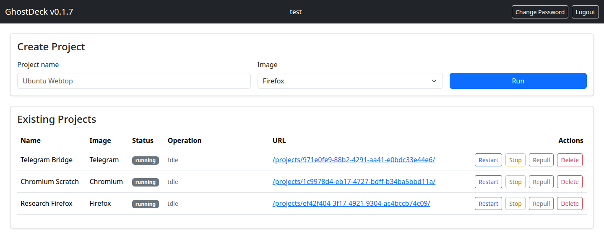
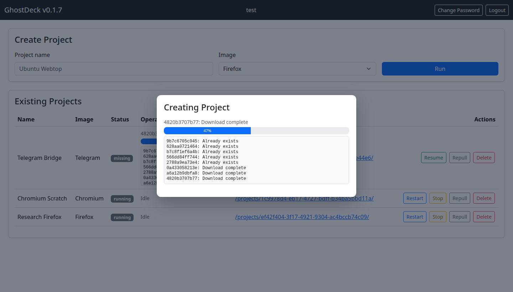
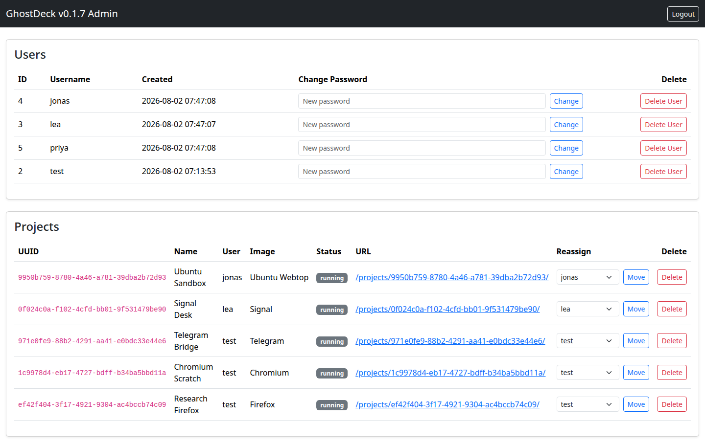

# GhostDeck

<!--
Source of truth for the README of github.com/solivagvs-dev/ghostdeck.
The Configuration table and the Workspace Isolation section are kept
identical to packaging/docs/dockerhub.md — change both together.
The three images live at docs/img/ in that repository.
-->

Self-hosted dashboard for disposable browser, messenger, Kali and Ubuntu workspaces. Create a workspace from a web form, use it in a browser tab, throw it away.

GhostDeck manages the workspace containers through the Docker socket and serves the dashboard and every workspace through a managed Caddy container with HTTPS. Workspaces need no host ports and no VNC client.



## What It Does

- One-click workspaces from a fixed image catalog: Firefox, Brave, Chrome, Chromium, Telegram, Signal, Ubuntu Webtop, Kali Linux.
- Multi-user, with per-user project ownership and an admin view over everyone's workspaces.
- Each workspace on its own Docker network, reachable only through an authenticated proxy route.
- HTTPS out of the box through a managed Caddy container, including internal certificates for lab hostnames.
- Stop, resume, repull and delete from the dashboard; workspace home directories persist across restarts.

## Install — Debian / Ubuntu

Download the package for your architecture from [Releases](https://github.com/solivagvs-dev/ghostdeck/releases/latest), verify it, and install:

```bash
version=0.1.7   # check Releases for the current one
curl -LO https://github.com/solivagvs-dev/ghostdeck/releases/latest/download/ghostdeck_${version}_amd64.deb
curl -LO https://github.com/solivagvs-dev/ghostdeck/releases/latest/download/SHA256SUMS
sha256sum -c SHA256SUMS --ignore-missing

sudo apt install ./ghostdeck_${version}_amd64.deb
```

Use `apt install ./file.deb` rather than `dpkg -i`: the package depends on `docker.io | docker-ce` and `systemd`, and apt resolves those for you. `arm64` packages are published alongside `amd64`.

Start it and read the generated admin password:

```bash
sudo systemctl enable --now ghostdeck
sudo cat /var/lib/ghostdeck/.initial-admin-password
```

Then open `https://<host>/` and sign in at `/admin/`.

## Install — Docker

```yaml
services:
  ghostdeck:
    image: solivagvs/ghostdeck:latest
    container_name: ghostdeck
    restart: unless-stopped
    volumes:
      - /var/run/docker.sock:/var/run/docker.sock
      # Must be the same absolute path inside and outside the container.
      # Named volumes will not work here.
      - /var/lib/ghostdeck:/var/lib/ghostdeck
    environment:
      TZ: Europe/Berlin
```

```bash
sudo mkdir -p /var/lib/ghostdeck
docker compose up -d
sudo cat /var/lib/ghostdeck/.initial-admin-password
```

Images are published as `solivagvs/ghostdeck:latest` and `:<version>` (multi-arch manifests for `linux/amd64` and `linux/arm64`), plus single-architecture `:<version>-amd64` and `:<version>-arm64`.

No configuration is required to start. On first run GhostDeck writes `/var/lib/ghostdeck/.env` with a generated `APP_SECRET`, a generated admin password and every default below. That file is never rewritten afterwards; environment variables set on the service or container override it.



## Configuration

| Variable | Default | Purpose |
| --- | --- | --- |
| `APP_SECRET` | generated | HMAC key for session and CSRF cookies. Changing it signs everyone out. |
| `ADMIN_PASSWORD` | generated | Admin login. Ignored when `ADMIN_PASSWORD_HASH` is set. |
| `ADMIN_PASSWORD_HASH` | empty | bcrypt hash instead of a plaintext password. Compose expands `$`, so double it. |
| `REGISTRATION_TOKEN` | empty | Invite code for `/register`. **Empty leaves signup open to anyone who can reach the dashboard.** |
| `PROJECT_NETWORK_ISOLATION` | `true` | One Docker network per project. `false` puts every workspace on the shared network. |
| `DOCKER_NETWORK` | `ghostdeck-net` | Base network name. Per-project networks are `<name>-p<id>`. |
| `PROJECT_UNCONFINED` | `false` | Runs workspaces with `seccomp=unconfined`. Only needed if an image will not start otherwise. |
| `CADDY_HTTP_BIND` | `80` | Host port for HTTP. `off` disables it. `127.0.0.1:8080` binds one address. |
| `CADDY_HTTPS_BIND` | `443` | Host port for HTTPS, same syntax. |
| `TRUSTED_PROXIES` | none | CIDRs whose `X-Forwarded-For` is trusted, so login rate limits see the real client address. |
| `PUID` / `PGID` | `1000` | uid and gid owning workspace files. |
| `TZ` | `Europe/Berlin` | Workspace timezone. |
| `IMAGE_<NAME>_ENABLED` | `true` | Catalog toggles: `FIREFOX`, `BRAVE`, `CHROME`, `CHROMIUM`, `TELEGRAM`, `SIGNAL`, `UBUNTU`, `KALI`. |

## Users and Registration

Users sign up at `https://<host>/register` and see only their own workspaces. Registration is **open by default**: anyone who can reach the dashboard can create an account and start a container on your Docker host. Set `REGISTRATION_TOKEN` to require a shared invite code, which adds an **Invite code** field to the form and rejects everything else. Wrong codes are rate limited per source address, as are failed logins.

Admins manage every account and workspace from `/admin/`, including reassigning a workspace to another user and resetting passwords.



## Workspace Isolation

Each project container runs on its own Docker bridge network, `<DOCKER_NETWORK>-p<project-id>`. Only the managed Caddy container is attached to every project network, so one workspace cannot reach another workspace's container directly; reaching one through Caddy requires a session that owns it.

Isolation applies between workspaces only. Every workspace keeps normal outbound access to the internet, the host's LAN and ports published on the host. Kali workspaces run with `NET_ADMIN` and `NET_RAW`, and Ubuntu Webtop runs with `apparmor=unconfined`.

## Security Notes

- Workspaces are served from the dashboard origin, so a compromised workspace image can act as the logged-in user. Admins opening someone else's workspace should use a browser profile not signed in to `/admin/`.
- Runtime state — the session database, generated Caddy config and every workspace home directory — lives in `/var/lib/ghostdeck`, created `0700`.
- GhostDeck publishes no ports itself. Its managed Caddy container publishes `80` and `443`.
- The default certificate comes from Caddy's internal CA, so browsers warn until you trust it. Point `CADDY_HTTPS_SITE_ADDRESS` at a real hostname for a public certificate.
- Security events are logged with an `audit event=` prefix: `journalctl -u ghostdeck | grep 'audit event='`, or `docker logs ghostdeck 2>&1 | grep 'audit event='`.

## Support

Bug reports and questions: [Issues](https://github.com/solivagvs-dev/ghostdeck/issues). Include the GhostDeck version, install method and the relevant log lines.

## Licensing

GhostDeck is not open source. This repository distributes the packaged builds and their documentation; the source is not published. <!-- State here what recipients may do with the binaries: personal/internal use, redistribution, and any warranty disclaimer. -->
